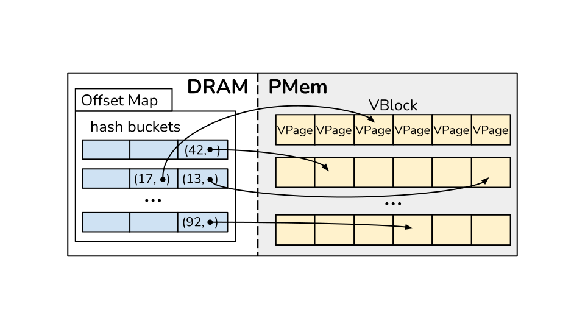
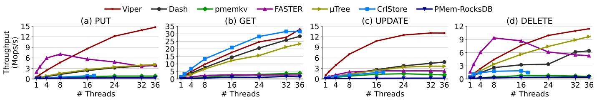

<p align="center">
  
</p>

<p align="justify">
Key-value stores (KVSs) have found wide application in modern software systems. For persistence, their data resides in slow secondary storage, which requires KVSs to employ various techniques to increase their read and write performance from and to the underlying medium. Emerging persistent memory (PMem) technologies offer data persistence at close-to-DRAM speed, making them a promising alternative to classical disk-based storage. However, simply drop-in replacing existing storage with PMem does not yield good results, as block-based access behaves differently in PMem than on disk and ignores PMem's byte addressability, layout, and unique performance characteristics. In this paper, we propose three PMem-specific access patterns and implement them in a hybrid PMem-DRAM KVS called Viper. We employ a DRAM-based hash index and a PMem-aware storage layout to utilize the random-write speed of DRAM and efficient sequential-write performance PMem. Our evaluation shows that Viper significantly outperforms existing KVSs for core KVS operations while providing full data persistence. Moreover, Viper outperforms existing PMem-only, hybrid, and disk-based KVSs by 4--18x for write workloads, while matching or surpassing their get performance.
</p>


## Using Viper
Viper is an embedded header-only key-value store for persistent memory.
You can download it and include it in your application.
Here is a short example of Viper's interface.

```cpp
#include <iostream>
#include "viper/viper.hpp"

int main(int argc, char** argv) {
    const size_t initial_size = 1073741824;  // 1 GiB
    auto viper_db = viper::Viper<uint64_t, uint64_t>::create("/mnt/pmem2/viper", initial_size);

    // To modify records in Viper, you need to use a Viper Client.
    auto v_client = viper_db->get_client();

    for (uint64_t key = 0; key < 10; ++key) {
        const uint64_t value = key + 10;
        v_client.put(key, value);
    }

    for (uint64_t key = 0; key < 10; ++key) {
        uint64_t value;
        v_client.get(key, &value);
        std::cout << "Record: " << key << " --> " << value << std::endl;
    }
}
```

## Viper Architecture



Viper consists of a volatile index in DRAM to achieve high random access performance and a persistent storage layer in PMem.
Check out the paper for more details on why we chose this design.

## Viper Performance



Viper outperforms existing PMem key-value stores by up 4--18x when inserting and achieves equal or better *get* performance.
Check out the paper for additional evaluation.


## Bibliography

If you use Viper in your work, please cite us.
```
@article{benson_viper_2021,
  author    = {Lawrence Benson and Hendrik Makait and Tilmann Rabl},
  title     = {Viper: An Efficient Hybrid PMem-DRAM Key-Value Store},
  journal   = {Proceedings of the {VLDB} Endowment},
  volume    = {14},
  number    = {9},
  year      = {2021},
  doi       = {10.14778/3461535.3461543},
}
```
